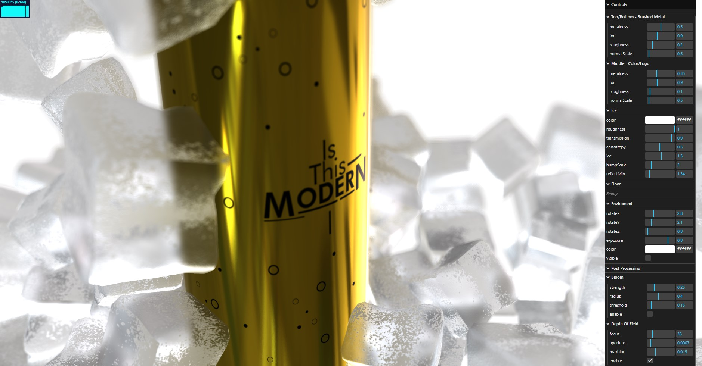
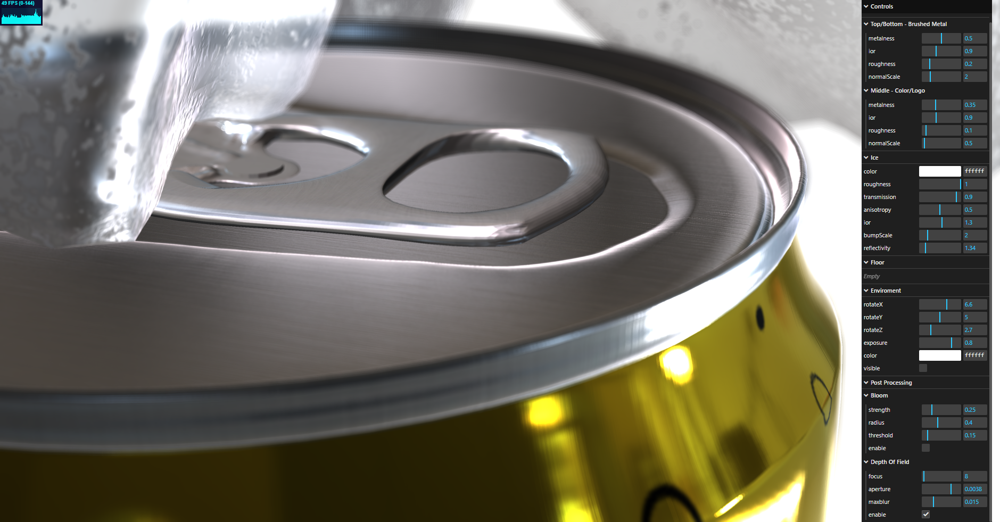

<h1 align="center" id="title">💡 3D Model Viewer - ThreeJS</h1>

This is a proof of concept for converting Maya exports to threejs. There will be a physically accurate version of this with the implementation of pathtracing <a href="https://github.com/gkjohnson/three-gpu-pathtracer">from here</a>

<h2 align="center">🚀 Demo</h2>

<a href="https://urltobeupdated">https://urltobeupdated</a>

<h2>🧐 About</h2>

*   I used PBR materials. Some from Polliigon and some custom textures
*   I made a basic loader
*   This is propably going to get updated testing animations,lights and more..
*   <s>Runs well even on mobile</s> Propably not yet

<h2>💖Like my work?</h2>

Any feedback is appreciated. You can email me any suggestions or improvements so I can use them in any future projects.  
Any addition is welcome Thank you

<h2># Recent Project Screenshots:</h2>

  
  

<h2>🛡️ License:</h2>

This project is licensed under the Apache License Version 2.0 January 2004 http://www.apache.org/licenses/

